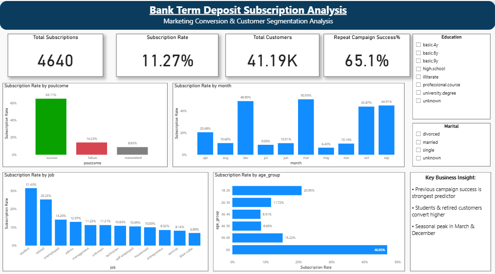
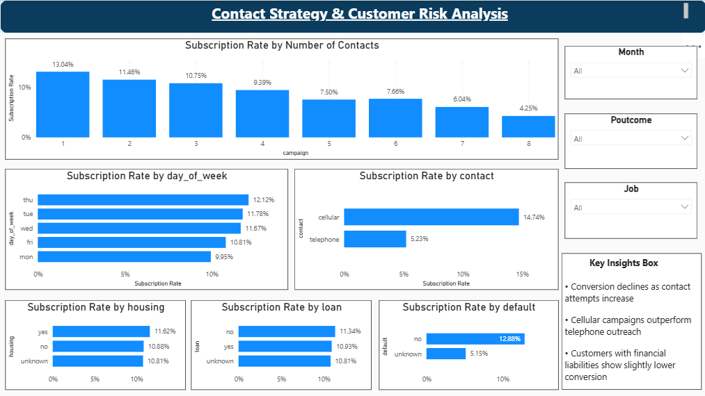

<h1 align="center">📊 Bank Term Deposit Subscription Analysis</h1>

<p align="center">
  End-to-end Data Analyst project focused on customer subscription behavior, campaign performance, and business-driven marketing insights.
</p>

<p align="center">
  
  
  
  
  
  
</p>

<p align="center">
  <a href="https://www.linkedin.com/in/YOUR-LINKEDIN-USERNAME/">
    
  </a>
  <a href="https://github.com/YOUR-GITHUB-USERNAME">
    
  </a>
</p>

---

## 📌 Project Overview

This project analyzes a real-world banking marketing dataset to identify the key factors influencing customer subscription to term deposits.

The project was built as an **end-to-end Data Analyst workflow**, covering:

- data understanding
- data cleaning
- exploratory data analysis
- multivariate analysis
- business recommendations
- Power BI dashboarding

---

## 🎯 Business Problem

Banks invest heavily in direct marketing campaigns, but conversion rates are often low.

This project aims to:

- identify the key drivers of term deposit subscription
- detect high-conversion customer segments
- evaluate campaign effectiveness
- support better targeting and marketing decisions

---

## 🗂 Dataset Summary

- **Records:** 41,188  
- **Features:** 21  
- **Target Variable:** `y` (term deposit subscription)

The dataset contains:
- customer demographics
- financial attributes
- campaign details
- previous campaign outcomes
- economic indicators

---

## 🛠 Tools & Technologies

- **Python**
- **Pandas**
- **NumPy**
- **Matplotlib**
- **Seaborn**
- **Power BI**

---

## 🔍 Analysis Performed

### 1. Data Preparation
- validated dataset structure
- checked duplicates and categorical consistency
- retained meaningful business values such as `unknown` and `pdays = 999`

### 2. Univariate Analysis
- analyzed the target variable (`y`)
- identified class imbalance in customer subscription behavior

### 3. Bivariate Analysis
Analyzed the relationship between subscription and:
- age group
- job
- education
- marital status
- contact type
- month
- campaign frequency
- housing loan
- personal loan
- default status
- previous campaign outcome

### 4. Multivariate Analysis
Performed combined analysis for:
- age group × job × subscription
- education × job × subscription
- previous campaign outcome × age group × subscription

### 5. Power BI Dashboard
Built a **two-page dashboard**:
- **Page 1:** Executive Overview
- **Page 2:** Contact Strategy & Customer Risk Analysis

---

## 📊 Dashboard Preview

### Page 1 — Executive Overview
<p align="center">
  
</p>

### Page 2 — Contact Strategy & Customer Risk Analysis
<p align="center">
  
</p>

---

## 💡 Key Insights

- Overall subscription rate was **11.27%**
- Previous campaign success was the strongest predictor, with **~65% repeat conversion**
- Older and middle-aged customer groups showed relatively higher subscription likelihood than younger groups
- Students and retired customers showed stronger conversion patterns
- Cellular contact performed better than telephone
- Conversion decreased as the number of campaign contacts increased
- Campaign performance showed seasonal variation, with stronger months including **March** and **December**

---

## 📈 Business Recommendations

- prioritize customers with previous successful campaign outcomes
- focus marketing efforts on high-conversion customer segments
- reduce excessive follow-up calls to avoid customer fatigue
- optimize campaign timing during high-performing months
- improve targeting for first-time contacts using additional customer attributes

---

## 📁 Repository Structure

```bash
Bank-Term-Deposit-Analysis/
│
├── Bank_Term_Deposit_EDA.ipynb
├── Bank_Term_Deposit_Analysis_Report.pdf
├── Bank_Term_Deposit_Dashboard.pbix
├── dashboard_page1.png
├── dashboard_page2.png
└── README.md


# Bank-Term-Deposit-Analysis
📊 Bank Term Deposit Subscription Analysis
📌 Project Overview

This project analyzes a real-world banking dataset to identify factors influencing customer subscription to term deposits.

🔍 Analysis Performed

Data Cleaning & Validation

Univariate Analysis (Target Variable)

Bivariate Analysis

Multivariate Analysis

Business Recommendations

📊 Key Insights

Previous campaign outcome is the strongest predictor (~65% conversion)

Customer segmentation improves targeting efficiency

Seasonal patterns impact subscription rates

Job role and education influence customer behavior

🛠 Tools Used

Python | Pandas | NumPy | Matplotlib | Seaborn | Power BI

💡 Business Value

This project demonstrates how data-driven marketing strategies can improve campaign efficiency and increase subscription rates.
